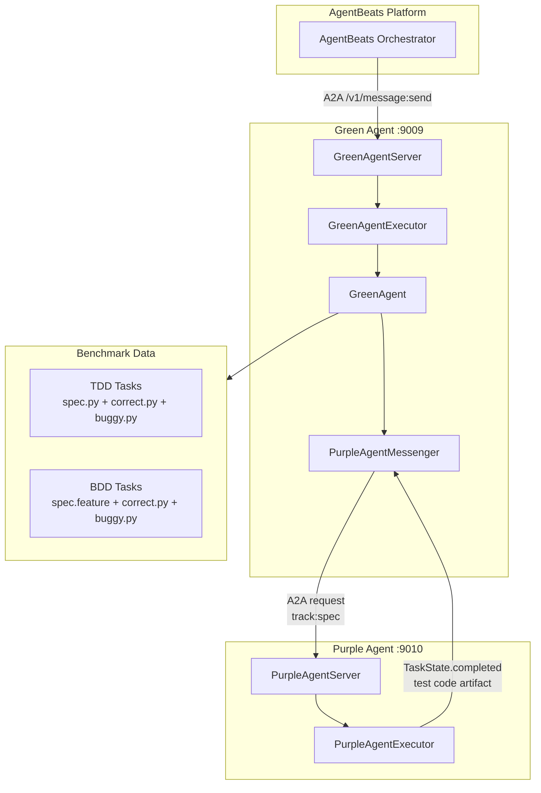
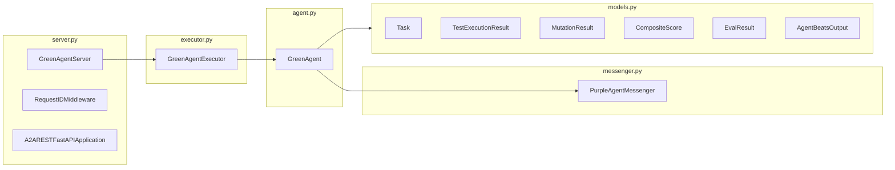
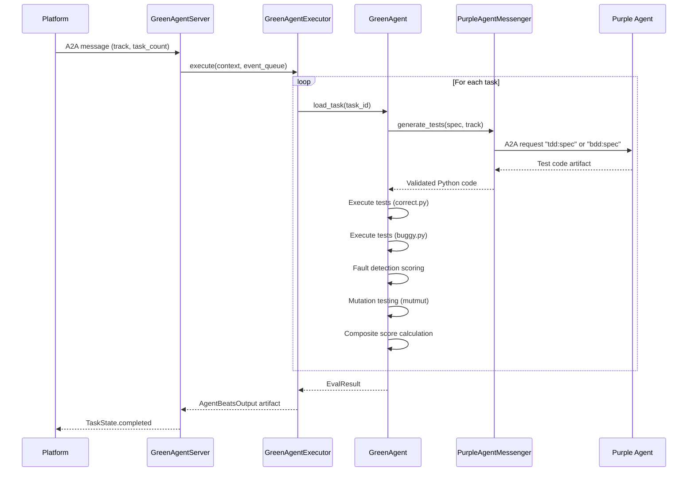

# Architecture

Multi-agent evaluation system for the AgentBeats competition. Green Agent
(evaluator) scores Purple Agent (test generator) on fault detection and
mutation testing across TDD and BDD tracks.

## System Overview



## Component Hierarchy



## Package Structure

```text
src/
  green/                     # Evaluator agent (fully implemented)
    server.py                # A2A HTTP server, uvicorn, middleware
    executor.py              # AgentExecutor, pipeline orchestration
    agent.py                 # Core logic: load, execute, score, output
    messenger.py             # A2A client to Purple Agent
    models.py                # Pydantic domain models (all frozen)
    settings.py              # Config from scenario.toml + env
    data_prep/               # Benchmark data preparation
      download_evalplus.py   # HumanEval+ task download
      generate_variants.py   # Bug injection (correct.py -> buggy.py)
      generate_bdd.py        # TDD spec -> Gherkin feature files
  purple/                    # Test generator agent (skeleton)
    server.py, executor.py, agent.py, messenger.py, models.py, settings.py
  common/
    models.py                # Shared models (placeholder)
```

## Evaluation Pipeline



## Scoring Model

```text
composite_score = (w1 * mutation_score) + (w2 * fault_detection_rate)
```

Per task:

| Metric | Source | Description |
| --- | --- | --- |
| `fault_detection_rate` | pytest exit codes | Tests pass on `correct.py`, fail on `buggy.py` |
| `mutation_score` | mutmut | `killed_mutants / total_mutants` |
| `composite_score` | weighted formula | Combined per-task score |

Aggregated into `EvalResult` with `score`, `pass_rate`, and per-task details.

## Domain Models

All models in `models.py` use `frozen=True` for immutability.

```text
AgentBeatsOutput
  participants: list[str]
  results: EvalResult
    score: float
    pass_rate: float
    rewards: TaskRewards
    detail: ResultDetail
      tasks: list[TaskDetail]
        task_id: str
        test_execution: TestExecutionResult
        mutation: MutationResult
        composite: CompositeScore
```

## Communication Protocol

Both agents use the [A2A SDK](https://github.com/google-a2a/a2a-python) for
inter-agent communication.

- **Discovery**: `ClientFactory.connect(url)` resolves
  `/.well-known/agent-card.json`
- **Transport**: `httpx.AsyncClient` with configurable timeout
- **Messages**: `create_text_message_object(content=f"{track}:{spec}")`
- **Response**: Async event stream, extract `TextPart` from completed task
  artifacts
- **Reliability**: 3 retries with exponential backoff (1s, 2s, 4s)
- **Validation**: `ast.parse()` on returned test code

## Test Execution Isolation

Generated tests run in sandboxed subprocesses:

- Temporary directory per execution (cleaned up after)
- Network access blocked via `bubblewrap` (bwrap) when available
- Per-task timeout enforcement
- Separate runs against `correct.py` and `buggy.py`

## Configuration

Runtime config via `scenario.toml`:

```toml
[green_agent]
agentbeats_id = "..."

[[participants]]
agentbeats_id = "..."
name = "purple"

[config]
track = "tdd"           # "tdd" or "bdd"
task_count = 5
timeout_per_task = 60
```

## Quality Gates

Enforced by `make validate`:

| Gate | Tool | Threshold |
| --- | --- | --- |
| Lint + format | ruff | Zero violations |
| Type checking | pyright (strict) | Zero errors |
| Cognitive complexity | complexipy | Max 15 per function |
| Test coverage | pytest-cov | All tests pass |

## Tech Stack

| Layer | Technology |
| --- | --- |
| Runtime | Python >= 3.13 |
| Agent protocol | a2a-sdk >= 0.3.20 |
| HTTP server | uvicorn + FastAPI (via a2a-sdk) |
| HTTP client | httpx |
| Data models | pydantic + pydantic-settings |
| Test execution | pytest, pytest-bdd |
| Mutation testing | mutmut |
| Benchmark data | EvalPlus (HumanEval+) |
